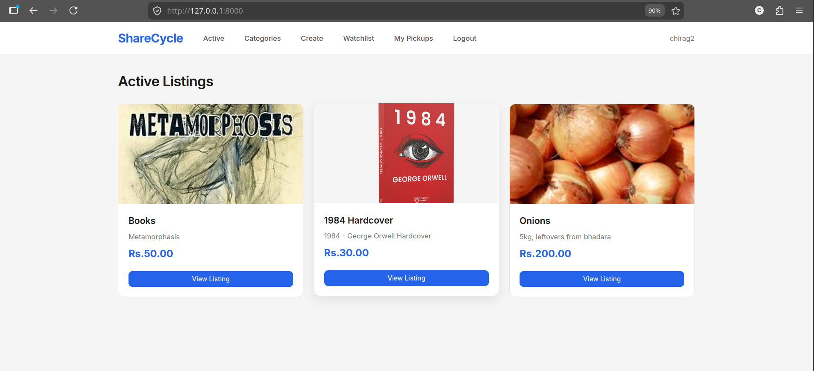
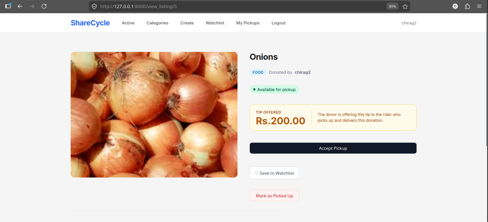
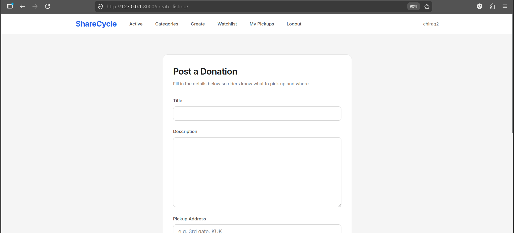
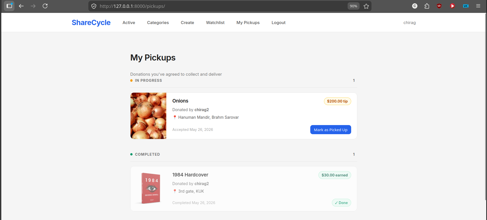
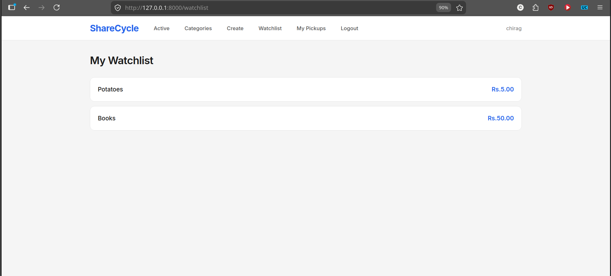
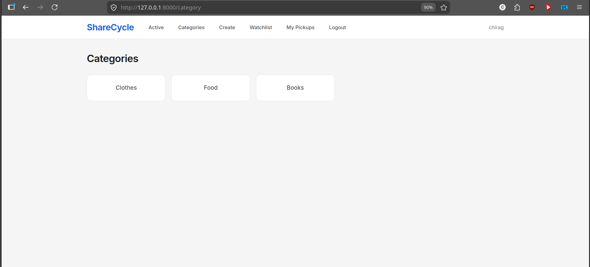

# ShareCycle: Hyperlocal Goods Redistribution Platform

**ShareCycle** is a Django-based Server-Side Rendered (SSR) web application designed for hyperlocal goods redistribution. Built using Django Templates, it allows community members to list surplus items, organize categories, save listings to watchlists, and manage pickup logistics directly through a clean web interface.

---

## Demo

* **Deployed Link:** https://sharecycle.chiragsingla014.dev/
---

## Screenshots

* **Home Page:** 

* **Listing Page:** 
* **Post Page:** 
* **Pickup Page:** 
* **Watchlist Page:** 
* **Category Page:** 

---

## Features

* **User Authentication:** Full user registration, login, and session management system.
* **Listing Management:** Create new listings, view item details, and manage closed or active listings.
* **Pickup & Logistics:** Assign pickup addresses and manage acceptance statuses for local item collection.
* **Categories & Filtering:** Categorize donations and filter listings by category tags.
* **Watchlist:** Save interested items to a personal watchlist for quick tracking.
* **Admin Dashboard:** Native Django Admin integration for overseeing users, listings, and pickup workflows.

---

## Tech Stack

| Layer | Technology |
| :--- | :--- |
| **Backend Framework** | Django (Python) |
| **Frontend / Rendering** | Server-Side Rendering (SSR) via Django Template Language (DTL), HTML5, CSS3 |
| **Database** | PostgreSQL (`neon.tech`) |
| **Deployment Configuration** | Vercel (`vercel.json`) |

---

## Getting Started

### Prerequisites

* Python 3.10+
* `pip` package manager
* `virtualenv` (recommended)

### Installation & Setup

1. **Clone the repository:**
   ```bash
   git clone https://github.com/chiragsingla014/commerce.git
   cd commerce
   ```

2. **Create and activate a virtual environment:**
   ```bash
   python -m venv venv
   source venv/bin/activate  # On Windows use: venv\Scripts\activate
   ```

3. **Install dependencies:**
   ```bash
   pip install -r requirements.txt
   ```
4. **Create .env file:**
   ```env
   DATABASE_URL="your_db_url"
   ```

5. **Apply database migrations:**
   ```bash
   python manage.py migrate
   ```

6. **Create a superuser (for Django Admin access):**
   ```bash
   python manage.py createsuperuser
   ```

7. **Run the development server:**
   ```bash
   python manage.py runserver
   ```

8. **Access the app:**
   Open your browser and navigate to `http://127.0.0.1:8000/`.